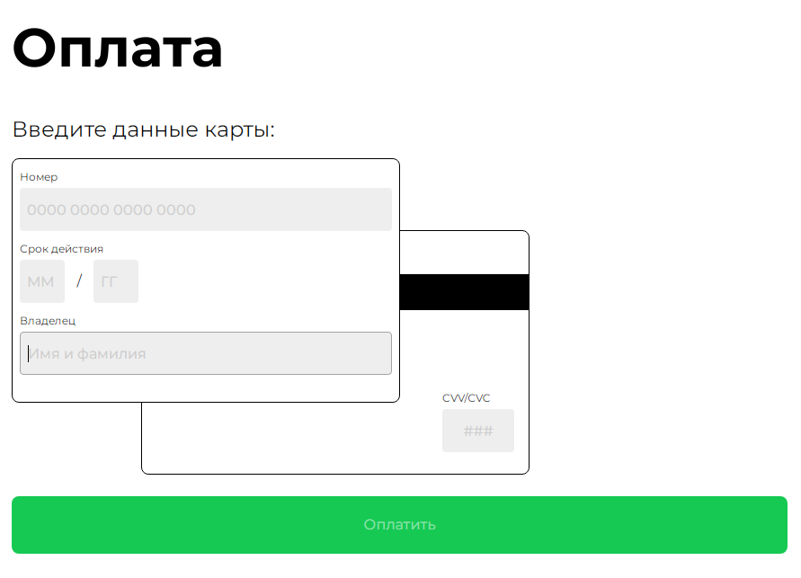

# Pcard

__Pcard__ позволяет вводить данные банковской карты и получать данные в виде объекта для последующей обработки.

- [Демо](https://mchlv.ru/projects/pcard/)
- [Макет в Figma](https://www.figma.com/file/Dfi3l7BcZbXCcTtflPUvgH/Pcard?node-id=0%3A1)




## Возможности
- проверка ввода данных;
- изменение оформления полей с ошибками и проверенных;
- адаптивный дизайн (<768px и >=768px)


## Подключение и работа


1. Форма размещается внутри контейнера с id или class, который указывается при создании экземпляра класса:

    ```javascript
    import { Pcard } from './Pcard.js';

    let card = new Pcard('.card_1'); // id или class контейнера-родителя
    ```


2. Input-поля формы должны иметь соответствующие data-аттрибуты:
    - ``` data-el="number" ``` - для номера карты;
    - ``` data-el="month" ``` - для месяца;
    - ``` data-el="year" ``` - для года;
    - ``` data-el="name" ``` - для имени владельца;
    - ``` data-el="cvv" ``` - для cvv-кода.


3. Введенные данные карты доступы в виде объекта с помощью свойства ```getData```:
    ```javascript
    let card = new Pcard('.card_1');
    console.log(card.getData); 
    ```
    <br/>

    Пример результата верно заполненной формы:

    ```json
    {
        "number": {
            "value": "1234567891011121",
            "valueFormatted": "1234 5678 9101 1121",
            "isValid": true
        },
        "name": {
            "value": "firstname lastname",
            "isValid": true
        },
        "month": {
            "value": "08",
            "isValid": true
        },
        "year": {
            "value": "22",
            "isValid": true
        },
        "cvv": {
            "value": "888",
            "isValid": true
        }
    }
    ```


## Стили
Редактирование стилей возможно в файле: ``` ./styles/styles.scss ```
- Поля с ошибками имеют  класс ```.error```
- Проверенные поля имеют класс ```.success```